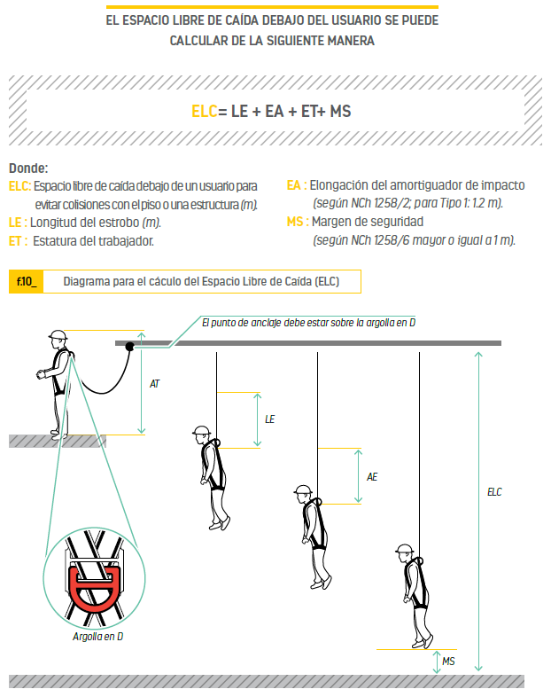
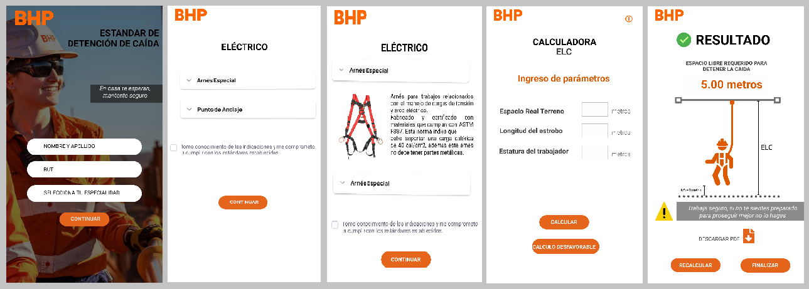

# DESAFÍO BHP: CÁLCULO DEL ESPACIO LIBRE DE CAÍDA

## CONTEXTO:

Minera Spencer publicó en abril de 2021 el Estándar Sistema de Detención de Caídas (S-INGE-CE-001), en el cual se entregan lineamientos para trabajos en altura y el cálculo del espacio libre de caída (ELC).

Este estándar genera recomendaciones del tipo de arnés y el punto de anclaje que se requieren verificar para asegurar su cumplimiento.

Para reducir el riesgo de un accidente por el incumplimiento del estándar y la falta de verificación en terreno, es necesario poder asistir a los usuarios mantenedores a realizar los cálculos y las verificaciones en terreno.

## PROPUESTA:

Se propone la creación de una aplicación móvil que permita guiar a los usuarios mantenedores en:

-	La selección del tipo de arnés (diferente según la especialidad del mantenedor y el trabajo a realizar): se informan las características del equipo y su código SAP.

-	La verificación del punto de anclaje.

-	Si el mantenedor tiene el arnés correspondiente y ha verificado el punto de anclaje, la aplicación solicitará los datos para el cálculo del Espacio Libre de Caída (ELC). Realizado el cálculo:

    - Si el ELC es menor al espacio real de terreno, el usuario Mantenedor no podrá proceder con el trabajo, y será alertado de ello por la aplicación.

    - Si el ELC es mayor o igual al espacio real de terreno, el usuario Mantenedor podrá proceder con el trabajo.

## PARÁMETROS PARA EL CÁLCULO DEL ELC:

## FÓRMULA:

ELC = LE + EA + ET + MS; (ELC >= Espacio Real de Terreno).

Donde:

ELC: Espacio libre de caída debajo de un usuario para evitar colisiones con el piso o una estructura medida en metros.

LE: Longitud del estrobo en metros.

ET: Estatura del trabajador en metros.

EA: Elongación del amortiguador de impacto.

MS: Margen de seguridad.

## SOLUCIÓN

## GENERALIDADES:

La aplicación es una herramienta de control y soporte, cuya utilidad es la de guiar a los usuarios (para el caso, usuarios Mantenedores, es decir, trabajadores de Minera Spence o empresas colaboradoras) en la selección y verificación del equipo y condiciones de trabajo, en específico, del arnés de seguridad y el punto de anclaje, con el fin de que se cumplan los lineamientos para trabajos en altura y, consecuentemente, se reduzca el riesgo de accidente por incumplimiento del estándar.

## ESPECIFICACIONES (flujo de funcionamiento de la aplicación):

-	El usuario debe poder ingresar a la aplicación desde su navegador web, con su celular o computador.

-	Para poder usar la aplicación, el usuario debe leer y aceptar el EULA (acuerdo de licencia de usuario final).

-	El usuario debe autenticarse ingresando su nombre, apellido y RUT.

-	Adicionalmente, el usuario debe seleccionar su especialidad (la aplicación contempla la de soldador, la de eléctrico y la de trabajos generales). En base a esa selección, la aplicación muestra la información del tipo de arnés correspondiente a la especialidad en cuestión. A la par, la aplicación muestra información sobre el punto de anclaje, y pide que el usuario confirme que toma conocimiento de esta información.

-	Si el usuario efectúa la toma de conocimiento, es redireccionado al chequeo del equipo y el área de trabajo, donde, en suma, debe confirmar el buen estado del arnés, sus accesorios, la cuerda de vida y el punto de anclaje. La confirmación se efectúa tiqueando cada uno de los puntos listados que se cumplan. Solo si tiquea todos los puntos, el usuario podrá descargar un PDF de respaldo del chequeo, y será redireccionado al paso siguiente: el cálculo del espacio libre de caída (ELC).

-	Para el cálculo del ELC, el usuario debe ingresar tres parámetros: 1) el espacio real de terreno, 2) la longitud del estrobo, y 3) la estatura del trabajador. En base a estos (y a otros parámetros cuyos valores por defecto ya están considerados en la fórmula utilizada por la aplicación), se calcula y muestra el ELC.

-	El calculo puede o no ser favorable. Si lo es, el usuario podrá descargar un respaldo del cálculo en PDF, y podrá proseguir con su trabajo. Si no lo es, el usuario será advertido, y no podrá proseguir con su trabajo.

## Prototipo:

El prototipo de alta fidelidad de esta aplicación puede revisarse [aquí](https://www.figma.com/file/hOyUDUNOzLgE6SDUJ1eAOH/BHP-UX?node-id=0%3A1).

Adicionalmente, y a modo de ejemplo, se adjuntan fotos del mismo:

### Móvil:

